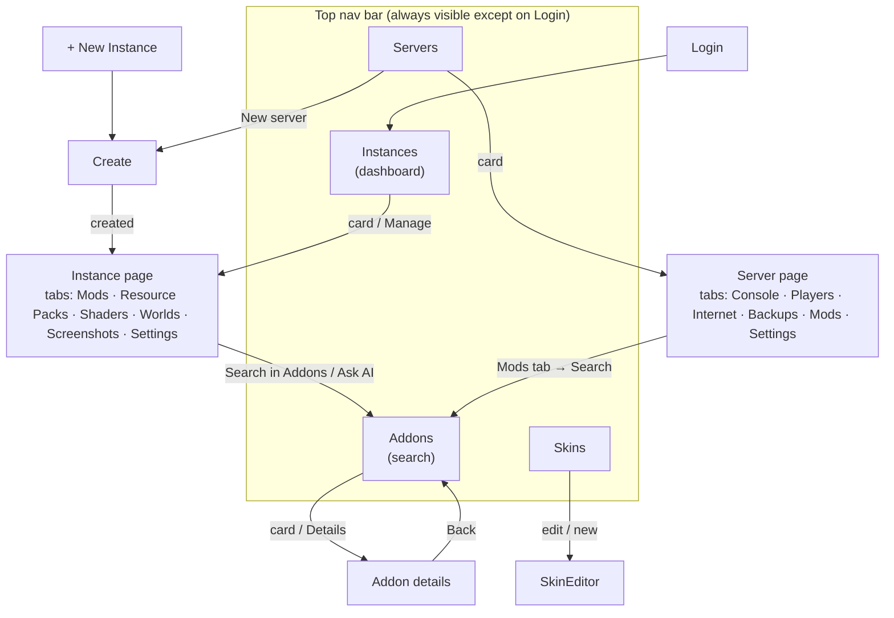

# 3. Navigation

## The model: one state value, no router

The launcher has **no URL router**. The page on stage is a single value,
`screen`, held in the app state (`frontend/src/state/index.tsx`), and
`App.tsx` (`Shell`) renders whichever screen it names. The app is small enough
that a router would add more than it saves.

```ts
type Screen =
  | { name: 'login' }
  | { name: 'dashboard' }                       // "Instances" page
  | { name: 'create'; server?: boolean }        // new instance, or new server
  | { name: 'instance'; id: string }
  | { name: 'servers' }
  | { name: 'server'; id: string }
  | { name: 'search'; instanceId?; type?; ai? } // "Addons" page
  | { name: 'detail'; result; instanceId? }     // one addon's full page
  | { name: 'skins' }
  | { name: 'skinEditor'; id? }
```

Two functions move the player: **`go(screen)`** and **`back()`**. Everything
else (buttons, cards, the nav bar) calls one of them.

## Screen map



| Screen | Reached from | Notes |
|---|---|---|
| `login` | app start when no profile exists | First screen only; never pushed to history |
| `dashboard` (**Instances**) | boot (profile exists), nav, profile switch | A **root**: clears history |
| `create` | nav "New Instance", empty-state button, Servers page, "Create instance" in dialogs | `server: true` makes the form build a server |
| `instance` | dashboard card / Manage, after create | Tabs remembered per instance |
| `servers` / `server` | nav, server cards | Tabs remembered per server |
| `search` (**Addons**) | nav, an instance's "Search in Addons" or "Ask AI", a server's Mods tab | With `instanceId` the page is **locked** to that instance |
| `detail` | result card / Details, AI pick's Details, an installed card in an instance's Mods / Resource Packs / Shaders tab | Carries `instanceId` so the lock survives Details → Back |
| `skins` / `skinEditor` | nav, skin cards | Editor keyed by skin id |

Dialogs (launch progress, update prompt, privacy, profile switch, close
confirmation) are **not screens**: they float above whichever screen is on stage
and are mounted once in `Shell`.

## The nav bar

`components/Nav.tsx` is a sticky top bar (72 px): logo, a **slider selector**
with four pages — *Instances, Servers, Skins, Addons* — the account menu and the
**New Instance** button.

The lit pill follows "which section am I in", not just the screen name:

| Current screen | Lit pill |
|---|---|
| `dashboard` | Instances |
| `servers`, `server` | Servers |
| `skins`, `skinEditor` | Skins |
| `search`, `detail` | Addons |
| `create`, `instance` | *none* (they're destinations, not sections) |

## History and Back

`go()` and `back()` keep a stack of previous screens:

- **Each entry stores the scroll position** (`scrollY`). Back restores it (two
  animation frames later, so the cached content has laid out).
- **Max 20 entries**; older ones are dropped.
- **Roots clear history:** going to `login` or `dashboard` empties the stack,
  so Back never leads to a stale page or returns to login.
- **Login is never pushed**, so Back can't land on it.
- **Going to the same screen again is a no-op** (compared by value).
- A new screen starts scrolled to the top; a screen reached with Back gets
  `cameBack = true`.
- Back with an empty stack falls back to the dashboard.

`components/BackButton.tsx` shows **"Back to <name>"** using `previous`
(the instance's name, the project title, "Addons", …). It is a sticky strip
under the nav and must be a direct child of the page's `<main>` so it stays
visible while the page scrolls.

### Restoring context on Back

Because navigation is state, "coming back" can restore *what the player was
doing*, not only the screen:

| Screen | What is restored | Mechanism |
|---|---|---|
| Addons | search text, type, version, loader, sort, categories, page number, **the results themselves**, AI panel open/closed | module-level `saved` snapshot, used only when `cameBack` and the same `instanceId` |
| Instance / Server page | the tab that was open | per-id `lastTab` map |
| Any | scroll position | history entry `scrollY` |

Leaving Addons any other way (a fresh nav click) starts clean.

## Profile switching

Switching or removing a profile reloads instances, servers, skins, language
and theme, then **navigates to the dashboard** (`switchTo`), because the page
the player was on may belong to the other profile.

## Two ways into Addons (same page, different rules)

| | From the nav | From an instance's "Search in Addons" |
|---|---|---|
| Screen value | `{ name: 'search' }` | `{ name: 'search', instanceId, type? }` |
| Version / loader filters | free | **locked** to the instance, shown disabled |
| Project types offered | all four | Vanilla → resource packs only · modded → all four · server → mods only |
| **Add** does | opens a picker of *compatible* instances (one click) | installs straight away |
| Cards already installed | not marked | read **Added** |

Rule of thumb: **installing takes at most two clicks.** No instances at all →
a dialog offers *Create instance*.

## Live updates while navigating

The UI does not poll. Go pushes events that state hooks subscribe to:
`install:progress` and `game:state` (launch controller), `content:progress`
(content queue → toasts), `server:state` (refreshes the instance/server lists),
`app:close` (opens the close-confirmation dialog). Launch and content progress
live in **separate React contexts** so a progress tick re-renders only the
notifications and Play buttons, never the whole screen.

## Dev shortcut

In a plain browser (no Wails), `?screen=login | create | search | servers |
server:<id> | skins | skinEditor:<id> | instance:<id>` jumps straight to a
screen, using the mock backend.
