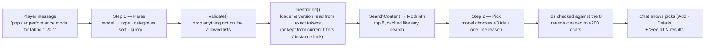

# 4. Search

The launcher searches **addons** (mods, resource packs, shaders, modpacks). It
does this in three layers, each usable without the next:

1. **API search** — a query goes to Modrinth's public API.
2. **Filters** — type, Minecraft version, loader, categories, sort, page.
3. **AI assistant** (optional) — turns a sentence into those filters and
   recommends a few results.

There is also a fourth, much smaller thing that looks like search but is not:
listing what an instance already has (see [Local lookups](#local-lookups-not-search)).

> **Indexation, honestly:** the launcher does **not** build or maintain a
> search index of its own. Modrinth indexes the catalog on its servers; the
> launcher only *queries* that index and *caches* the answers. There are no
> embeddings, no vector store, no full-text engine in this repo.

## End-to-end flow

```mermaid
sequenceDiagram
  participant P as Player
  participant S as Search screen (React)
  participant B as bridge → App.SearchContent (Go)
  participant M as modsearch.Manager
  participant R as Modrinth API
  P->>S: types text / changes a filter
  S->>S: debounce 350 ms, build key(type,text,version,loader,sort,categories)
  S->>B: SearchContent(type,text,version,loader,sort,categories,offset,30)
  B->>B: sanitise sort; keep only real categories
  B->>M: Search(Query)
  alt fresh in memory (<10 min)
    M-->>S: page (no request)
  else
    M->>R: GET /search?query&facets&index&offset&limit
    R-->>M: hits
    M->>M: save to memory + cache/search/<key>.json
    M-->>S: page
  end
  Note over M,R: If Modrinth is unreachable → last disk copy for the same key
```

## 1. The API

### Provider abstraction

`modsearch.Provider` (`internal/modsearch/provider.go`) is the only thing the
rest of the app knows about a marketplace. Modrinth is the sole implementation
(`modrinth.go`, base URL `https://api.modrinth.com/v2`, 15 s timeout — a browse
that takes longer should fall back to cache, not freeze the page).

| Method | Modrinth endpoint | Used for |
|---|---|---|
| `Search(Query)` | `GET /search` | The results grid, and the AI's search |
| `GameVersions()` | `GET /tag/game_version` | Version dropdown (releases only, ~100 of ~900 entries) |
| `Categories()` | `GET /tag/category` | Category vocabulary for the AI (loaders removed) |
| `ProjectDetail(id)` | `GET /project/{id}` | Details page (full description, gallery, links) |
| `Versions(id, mc, loader)` | `GET /project/{id}/version` | Add: choose the build that fits the instance |
| `VersionByID(id)` | `GET /version/{id}` | Dependencies pinned to a version |
| `VersionsByHashes(sha1s)` | `POST /version_files` | Modpacks: map files → projects |
| `Projects(ids)` | `GET /projects?ids=[…]` | Names/icons for dependencies and content list |

Only the first four serve *browsing*. The rest run **once, at Add time**, never
per card, so scrolling a page of 30 results costs one request.

### Wails bindings (what the UI can call)

| Binding | File | Purpose |
|---|---|---|
| `SearchContent(type, text, version, loader, sortBy, categories, offset, limit)` | `app_search.go` | One page of results → `{results, total, offset}` |
| `ListSearchGameVersions()` | `app_search.go` | Version dropdown |
| `AskAI(message, types, prev, lockVersion, lockLoader)` | `app_ai.go` | Chat answer (see §3) |
| `AIStatus / SetAI / ResetAI` | `app_ai.go` | AI provider settings |
| `ListInstalledProjects(instanceId)` | `app_content*.go` | Ids already in an instance ("Added") |

### What a result carries

`Result` = `id, slug, title, author, description (≤160 chars), iconUrl,
downloads, projectType, loaders[], gameVersions[]`. Loaders are picked out of
Modrinth's mixed category list (`fabric|forge|quilt|neoforge`); game versions
keep **releases only** (snapshots like `24w14a` are dropped). The full project
is fetched later, on the Details page.

## 2. Filters

A `Query` is provider-agnostic; the Modrinth adapter turns it into **facets**.

| Filter | UI control | Becomes (facet / param) | Rules |
|---|---|---|---|
| **Type** | Tabs: Mods · Resource Packs · Shaders · Modpacks | `project_type:<type>` (always present) | Instance mode narrows it: Vanilla → resource packs; server → mods |
| **Text** | Search box (debounced 350 ms) | `query=` | Under 3 characters is not saved to disk |
| **Minecraft version** | Dropdown | `versions:<v>` | Locked to the instance in instance mode |
| **Loader** | Dropdown (Mods & Modpacks only) | `categories:<loader>` (Quilt → `quilt` **or** `fabric`) | Never narrows resource packs/shaders; locked in instance mode |
| **Categories** | Removable tags (set by AI "See all") | one `categories:<name>` group each | All must match; unknown names dropped in Go; cleared when the type changes |
| **Sort** | Dropdown | `index=` `downloads` \| `newest` \| `updated` (omitted = relevance) | No ascending order exists in Modrinth |
| **Page** | Pager (Previous / numbers / Next / jump-to) | `offset`, `limit=30` | New page *replaces* the grid |

### How facets combine

Modrinth's `facets` is a JSON array of OR-groups that are ANDed. The launcher
emits one group per filter, so every filter narrows the result:

```json
[["project_type:mod"], ["versions:1.20.1"], ["categories:fabric"], ["categories:optimization"]]
```

For Quilt the loader group becomes `["categories:quilt","categories:fabric"]`
(an OR inside one group) because Quilt runs Fabric mods.

### Client-side behaviour

- **Race safety:** every request bumps a sequence number; only the latest may
  update the page, so a slow old query can't overwrite a newer one.
- **First load** shows skeleton cards; **paging** dims the old grid under a
  loader.
- **Fixed DOM size:** one page (30 cards) is mounted at a time.
- **Version list** is fetched once per app run and shared by every mount
  (`loadSearchVersions`).
- **Loader vs. modpacks:** Modrinth's loader filter on a modpack's *version
  list* is loose (it can return other loaders' builds), so the launcher
  filters those versions again itself when adding.

## Caching (the closest thing to "indexation")

Two layers in `modsearch.Manager`, plus a reusable idiom:

| Layer | Where | Lifetime | Role |
|---|---|---|---|
| Memory | Go map, ≤64 pages, oldest evicted | 10 min | Paging back/forth and re-running a query cost **no request** |
| Disk | `cache/search/<type>_<version>_<loader>_<sort>_<offset>_<hash8>.json` | until overwritten | **Offline fallback** — read only when Modrinth can't be reached |
| Lists | `cache/search/game_versions.json`, `categories.json` | once per process in memory + disk | Version dropdown, AI vocabulary |

`internal/cache.Fetch(path, source, fetch)` is the single idiom: *try the
network → on success write the file → on failure read the last file → if
neither, error "cannot reach Modrinth"*. The cache key is a deterministic name
from `(type, version, loader, sort, offset, sha1(text[+categories]))`, so the
same query always maps to the same file.

## Local lookups (not search)

These read the launcher's own files; there is no query language.

| What | Source | Used by |
|---|---|---|
| "Is this project already in the instance?" | `instances/<id>/content.json` → `ListInstalledProjects` | **Added** state on cards |
| Instance's mods/packs with icons & descriptions | `content.json` + folder listing → `ListContent` | Instance tabs (cards view) |
| Which instances can take an addon? | `utils/compat.ts` (version in project's versions; loader in project's loaders; Vanilla refuses mods) | Add picker and Details side panel |
| Worlds / screenshots / files | Directory reads on tab open | Instance tabs |

`content.json` is effectively a small **local index** of installed addons keyed
by project id and SHA-1, used for "already added", dependency checks
(`requiredBy`) and incompatibility checks.

## 3. AI support

The AI is an **interpreter and a ranker**, never a source of content.



### Step 1 — Read the request (`ai.Manager.Parse`)

- Input: the message (≤300 chars, control characters removed) and the **previous
  intent**, so follow-ups ("only forge", "newer ones") refine the last search.
- The model may only fill four fields: **type, categories, sort, query**.
- It is told the allowed values in the prompt: the page's types, Modrinth's real
  categories for each type, and how to map words to sorts ("popular" →
  `downloads`, "new" → `newest`, …).
- Claude also gets them as a **JSON schema** (structured outputs). Other
  providers are only asked for "JSON only", so the first `{…}` in the reply is
  parsed.
- **Loader and version are not left to the model.** They come from exact tokens
  in the message (`neoforge`, `1.20.1`) or from the current filters, because
  models confuse forge/neoforge and drop versions.
- `validate()` is the **trust boundary**: the reply is untrusted input. It keeps
  only allowed types, ≤2 categories valid for that type, a known version, a
  known loader (mods/modpacks only), a known sort; loader/version words are
  stripped from the keywords.
- **Instance lock wins:** if the search came from an instance, that instance's
  version and loader replace whatever the AI produced.

### Step 2 — Pick from real results (`ai.Manager.Pick`)

- The launcher runs the validated intent through the same `SearchContent` (so it
  is cached and offline-tolerant) and takes the **top 8**.
- The model receives `{id, title, description, downloads}` for each and returns
  up to **3** ids, each with a ≤20-word reason in the player's language.
- Ids not among the 8 are dropped and duplicates removed, so **every pick is a
  real Modrinth project**. Names, icons and versions come from Modrinth; the
  *reason* is the only model-written text the player sees, shown as plain text.
- **Graceful degradation:** if Pick fails (rate limit, unreadable answer), the
  chat shows Modrinth's top 3 with their own descriptions instead of reasons.

### What the player gets

- Chat message: "My picks from Modrinth for: Mods · optimization · 1.20.1 ·
  Fabric" — a template, **not** model text.
- Up to 3 rows with **Add** (same compatibility/dependency/incompatibility checks
  as any Add) and **Details**.
- **See all N results** copies the intent into the page's filters (tab, text,
  version, loader, sort, category tags) and scrolls to the grid. Until pressed,
  the page's own filters are untouched.

### Providers, keys, privacy

| | |
|---|---|
| Providers | Groq (default, built-in key), Claude, OpenAI, Gemini, Grok — 3 models each, marked **free plan** or **paid** |
| Transport | Requests are made **from Go**, so the web view never sees a key. Claude uses Anthropic's Go SDK; the others one OpenAI-style HTTP call (only `model` + `messages`) |
| Player's key | Stored in `<data dir>/ai.json`, mode `0600`; never returned to the UI (`AIStatus` only says whether one exists) |
| Built-in key | Not in the repo. Scrambled at release build time (`internal/ai/seal`, injected via `-ldflags`); a dev build has none and the panel asks for a key |
| Sent to the provider | The player's message, the allowed lists, and (Step 2) titles/descriptions/download counts of 8 public Modrinth projects. No profile, paths or instance contents |
| Errors | A rejected key and a rate limit have their own message; provider error text is cut short and the key is masked |

Limit: the built-in key's rate limit is **shared by all players**; when it is
exhausted the UI suggests using their own key. Full details, model lists and
rate-limit math: [AI search](../14-ai-search.md).

### Failure behaviour summary

| Situation | Result |
|---|---|
| No key / build without built-in key | Panel shows settings; normal search still works |
| Offline | Normal search serves the disk cache; AI fails with a clear error (needs internet) |
| Categories/versions list unavailable | Model still picks type + keywords |
| Model returns junk | Error "not understood"; page unaffected |
| Model invents a project | Impossible — picks are matched to the 8 returned ids |
| Pick step fails | Top 3 Modrinth results shown without reasons |

## Design decisions worth remembering

- **No local index** keeps the launcher light (a local model was tried and
  dropped for size/RAM); Modrinth's index does the work.
- **Provider interface** exists so CurseForge (needs an API key) could be added
  without UI changes. Modrinth has no world/map project type, so a "Worlds"
  section in Addons is blocked on a provider.
- **Compatibility checks happen at Add time**, not per card, to keep browsing
  to a single request.
- **AI output is always re-validated** — the model narrows *what to search*, it
  never decides *what exists*.
