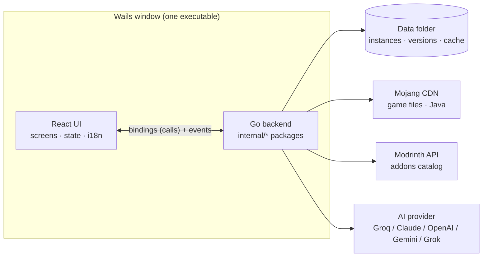

# System design — Udeos Launcher

Four short pages that describe the launcher as a *system*: what contains what,
what every word means, how a player moves through it, and how content is found.
They complement the numbered pages in [`docs/`](../README.md) (which explain
*how each feature is built*); read these first for the big picture.

| # | Page | Answers |
|---|------|---------|
| 1 | [Hierarchy](01-hierarchy.md) | What contains what: profile → instances → content, and the layers of the code |
| 2 | [Glossary](02-glossary.md) | Every word the system uses (instance, addon, loader, profile, …) and what it means |
| 3 | [Navigation](03-navigation.md) | Which screens exist, how the player moves between them, and how Back works |
| 4 | [Search](04-search.md) | How search works: the API, filters, caching/indexing, and the AI assistant |

## The system in one picture

- The **UI never touches the network or disk**. Everything goes through Go.
- **Modrinth** is the only source of addons and the only "search engine".
- The **AI** never invents addons: it only translates words into Modrinth
  filters and ranks what Modrinth returned.

> Scope note: these pages describe the code as of release 1.2.x-beta. Where
> something does *not* exist (e.g. there is no local search index), the page
> says so explicitly instead of implying it does.
