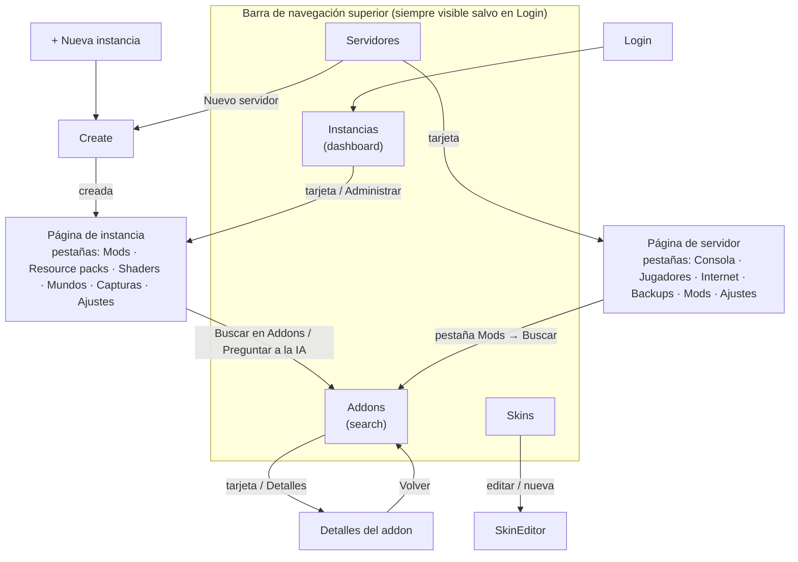

# 3. Navegación

## El modelo: un valor de estado, sin router

El launcher **no tiene router de URL**. La página en escena es un único valor,
`screen`, guardado en el estado de la app (`frontend/src/state/index.tsx`), y
`App.tsx` (`Shell`) renderiza la pantalla que ese valor nombra. La app es lo
bastante pequeña como para que un router aportara más complejidad de la que
ahorra.

```ts
type Screen =
  | { name: 'login' }
  | { name: 'dashboard' }                       // página "Instancias"
  | { name: 'create'; server?: boolean }        // nueva instancia, o nuevo servidor
  | { name: 'instance'; id: string }
  | { name: 'servers' }
  | { name: 'server'; id: string }
  | { name: 'search'; instanceId?; type?; ai? } // página "Addons"
  | { name: 'detail'; result; instanceId? }     // página completa de un addon
  | { name: 'skins' }
  | { name: 'skinEditor'; id? }
```

Dos funciones mueven al jugador: **`go(screen)`** y **`back()`**. Todo lo demás
(botones, tarjetas, la barra de navegación) llama a una de ellas.

## Mapa de pantallas



| Pantalla | Se llega desde | Notas |
|---|---|---|
| `login` | inicio de la app cuando no existe perfil | Solo como primera pantalla; nunca se apila en el historial |
| `dashboard` (**Instancias**) | arranque (si hay perfil), nav, cambio de perfil | Es una **raíz**: borra el historial |
| `create` | nav "Nueva instancia", botón del estado vacío, página Servidores, "Crear instancia" en diálogos | `server: true` hace que el formulario cree un servidor |
| `instance` | tarjeta del dashboard / Administrar, tras crear | Las pestañas se recuerdan por instancia |
| `servers` / `server` | nav, tarjetas de servidor | Las pestañas se recuerdan por servidor |
| `search` (**Addons**) | nav, "Buscar en Addons" o "Preguntar a la IA" de una instancia, pestaña Mods de un servidor | Con `instanceId` la página queda **bloqueada** a esa instancia |
| `detail` | tarjeta de resultado / Detalles, Detalles de una selección de la IA, una tarjeta instalada en las pestañas Mods / Resource packs / Shaders de una instancia | Lleva `instanceId` para que el bloqueo sobreviva a Detalles → Volver |
| `skins` / `skinEditor` | nav, tarjetas de skin | El editor se identifica por el id de la skin |

Los diálogos (progreso de lanzamiento, aviso de actualización, privacidad,
cambio de perfil, confirmación de cierre) **no son pantallas**: flotan sobre la
pantalla en escena y se montan una sola vez en `Shell`.

## La barra de navegación

`components/Nav.tsx` es una barra superior fija (72 px): logo, un **selector
deslizante** con cuatro páginas — *Instancias, Servidores, Skins, Addons* — el
menú de cuenta y el botón **Nueva instancia**.

La píldora iluminada sigue "en qué sección estoy", no solo el nombre de la
pantalla:

| Pantalla actual | Píldora iluminada |
|---|---|
| `dashboard` | Instancias |
| `servers`, `server` | Servidores |
| `skins`, `skinEditor` | Skins |
| `search`, `detail` | Addons |
| `create`, `instance` | *ninguna* (son destinos, no secciones) |

## Historial y Volver

`go()` y `back()` mantienen una pila de pantallas anteriores:

- **Cada entrada guarda la posición de scroll** (`scrollY`). Volver la restaura
  (dos frames de animación después, para que el contenido en caché se haya
  maquetado).
- **Máximo 20 entradas**; las más antiguas se descartan.
- **Las raíces borran el historial:** ir a `login` o `dashboard` vacía la pila,
  así Volver nunca lleva a una página obsoleta ni regresa al login.
- **Login nunca se apila**, así Volver no puede caer en él.
- **Ir a la misma pantalla otra vez no hace nada** (se compara por valor).
- Una pantalla nueva empieza con el scroll arriba; una pantalla alcanzada con
  Volver recibe `cameBack = true`.
- Volver con la pila vacía recurre al dashboard.

`components/BackButton.tsx` muestra **"Volver a <nombre>"** usando `previous`
(el nombre de la instancia, el título del project, "Addons", …). Es una franja
fija bajo la nav y debe ser hijo directo del `<main>` de la página para que siga
visible mientras la página se desplaza.

### Restaurar el contexto al Volver

Como la navegación es estado, "volver" puede restaurar *lo que el jugador estaba
haciendo*, no solo la pantalla:

| Pantalla | Qué se restaura | Mecanismo |
|---|---|---|
| Addons | texto de búsqueda, tipo, versión, loader, orden, categorías, número de página, **los resultados mismos**, panel de IA abierto/cerrado | instantánea `saved` a nivel de módulo, usada solo cuando `cameBack` y el mismo `instanceId` |
| Página de instancia / servidor | la pestaña que estaba abierta | mapa `lastTab` por id |
| Cualquiera | posición de scroll | `scrollY` de la entrada del historial |

Salir de Addons de cualquier otra forma (un clic nuevo en la nav) empieza desde
cero.

## Cambio de perfil

Cambiar o eliminar un perfil recarga instancias, servidores, skins, idioma y
tema, y luego **navega al dashboard** (`switchTo`), porque la página en la que
estaba el jugador puede pertenecer al otro perfil.

## Dos formas de entrar a Addons (misma página, distintas reglas)

| | Desde la nav | Desde "Buscar en Addons" de una instancia |
|---|---|---|
| Valor de pantalla | `{ name: 'search' }` | `{ name: 'search', instanceId, type? }` |
| Filtros de versión / loader | libres | **bloqueados** a la instancia, se muestran deshabilitados |
| Tipos de project ofrecidos | los cuatro | Vanilla → solo resource packs · con mods → los cuatro · servidor → solo mods |
| **Añadir** hace | abre un selector de instancias *compatibles* (un clic) | instala directamente |
| Tarjetas ya instaladas | sin marca | muestran **Añadido** |

Regla general: **instalar toma como máximo dos clics.** Si no hay ninguna
instancia, un diálogo ofrece *Crear instancia*.

## Actualizaciones en vivo mientras se navega

La UI no hace polling. Go envía eventos a los que se suscriben los hooks de
estado: `install:progress` y `game:state` (controlador de lanzamiento),
`content:progress` (cola de contenido → toasts), `server:state` (refresca las
listas de instancias/servidores), `app:close` (abre el diálogo de confirmación
de cierre). El progreso de lanzamiento y el de contenido viven en **contextos de
React separados**, de modo que un tick de progreso vuelve a renderizar solo las
notificaciones y los botones Jugar, nunca la pantalla completa.

## Atajo de desarrollo

En un navegador normal (sin Wails), `?screen=login | create | search | servers |
server:<id> | skins | skinEditor:<id> | instance:<id>` salta directamente a una
pantalla, usando el backend mock.
