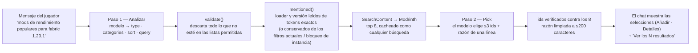

# 4. Búsqueda

El launcher busca **addons** (mods, resource packs, shaders, modpacks). Lo hace
en tres capas, cada una utilizable sin la siguiente:

1. **Búsqueda por API** — una consulta va a la API pública de Modrinth.
2. **Filtros** — tipo, versión de Minecraft, loader, categorías, orden, página.
3. **Asistente de IA** (opcional) — convierte una frase en esos filtros y
   recomienda unos pocos resultados.

Hay además una cuarta cosa, mucho más pequeña, que parece búsqueda pero no lo es:
listar lo que una instancia ya tiene (ver [Consultas locales](#consultas-locales-no-son-búsqueda)).

> **Indexación, con honestidad:** el launcher **no** construye ni mantiene un
> índice de búsqueda propio. Modrinth indexa el catálogo en sus servidores; el
> launcher solo *consulta* ese índice y *cachea* las respuestas. No hay
> embeddings, ni almacén de vectores, ni motor de texto completo en este repo.

## Flujo de extremo a extremo

```mermaid
sequenceDiagram
  participant P as Jugador
  participant S as Pantalla de búsqueda (React)
  participant B as bridge → App.SearchContent (Go)
  participant M as modsearch.Manager
  participant R as API de Modrinth
  P->>S: escribe texto / cambia un filtro
  S->>S: debounce 350 ms, construye clave(type,text,version,loader,sort,categories)
  S->>B: SearchContent(type,text,version,loader,sort,categories,offset,30)
  B->>B: sanea sort; conserva solo categorías reales
  B->>M: Search(Query)
  alt fresco en memoria (<10 min)
    M-->>S: página (sin petición)
  else
    M->>R: GET /search?query&facets&index&offset&limit
    R-->>M: hits
    M->>M: guarda en memoria + cache/search/<key>.json
    M-->>S: página
  end
  Note over M,R: Si Modrinth no es alcanzable → última copia en disco para la misma clave
```

## 1. La API

### Abstracción de proveedor

`modsearch.Provider` (`internal/modsearch/provider.go`) es lo único que el resto
de la app conoce de un marketplace. Modrinth es la única implementación
(`modrinth.go`, URL base `https://api.modrinth.com/v2`, timeout de 15 s — una
exploración que tarde más debe recurrir al caché, no congelar la página).

| Método | Endpoint de Modrinth | Se usa para |
|---|---|---|
| `Search(Query)` | `GET /search` | La cuadrícula de resultados y la búsqueda de la IA |
| `GameVersions()` | `GET /tag/game_version` | Desplegable de versiones (solo releases, ~100 de ~900 entradas) |
| `Categories()` | `GET /tag/category` | Vocabulario de categorías para la IA (sin loaders) |
| `ProjectDetail(id)` | `GET /project/{id}` | Página de detalles (descripción completa, galería, enlaces) |
| `Versions(id, mc, loader)` | `GET /project/{id}/version` | Añadir: elegir el build que encaja con la instancia |
| `VersionByID(id)` | `GET /version/{id}` | Dependencias fijadas a una versión |
| `VersionsByHashes(sha1s)` | `POST /version_files` | Modpacks: mapear archivos → projects |
| `Projects(ids)` | `GET /projects?ids=[…]` | Nombres/iconos de dependencias y de la lista de contenido |

Solo los cuatro primeros sirven para *explorar*. El resto se ejecuta **una vez,
al Añadir**, nunca por tarjeta, así que desplazarse por una página de 30
resultados cuesta una sola petición.

### Bindings de Wails (lo que puede llamar la UI)

| Binding | Archivo | Propósito |
|---|---|---|
| `SearchContent(type, text, version, loader, sortBy, categories, offset, limit)` | `app_search.go` | Una página de resultados → `{results, total, offset}` |
| `ListSearchGameVersions()` | `app_search.go` | Desplegable de versiones |
| `AskAI(message, types, prev, lockVersion, lockLoader)` | `app_ai.go` | Respuesta del chat (ver §3) |
| `AIStatus / SetAI / ResetAI` | `app_ai.go` | Ajustes del proveedor de IA |
| `ListInstalledProjects(instanceId)` | `app_content*.go` | Ids ya presentes en una instancia ("Añadido") |

### Qué lleva un resultado

`Result` = `id, slug, title, author, description (≤160 caracteres), iconUrl,
downloads, projectType, loaders[], gameVersions[]`. Los loaders se extraen de la
lista mixta de categorías de Modrinth (`fabric|forge|quilt|neoforge`); las
versiones del juego conservan **solo releases** (los snapshots como `24w14a` se
descartan). El project completo se obtiene después, en la página de Detalles.

## 2. Filtros

Una `Query` es independiente del proveedor; el adaptador de Modrinth la
convierte en **facets**.

| Filtro | Control de la UI | Se convierte en (facet / parámetro) | Reglas |
|---|---|---|---|
| **Tipo** | Pestañas: Mods · Resource packs · Shaders · Modpacks | `project_type:<type>` (siempre presente) | El modo instancia lo restringe: Vanilla → resource packs; servidor → mods |
| **Texto** | Caja de búsqueda (debounce 350 ms) | `query=` | Menos de 3 caracteres no se guarda en disco |
| **Versión de Minecraft** | Desplegable | `versions:<v>` | Bloqueada a la instancia en modo instancia |
| **Loader** | Desplegable (solo Mods y Modpacks) | `categories:<loader>` (Quilt → `quilt` **o** `fabric`) | Nunca restringe resource packs/shaders; bloqueado en modo instancia |
| **Categorías** | Etiquetas removibles (las fija "Ver todo" de la IA) | un grupo `categories:<name>` por cada una | Todas deben coincidir; los nombres desconocidos se descartan en Go; se limpian al cambiar el tipo |
| **Orden** | Desplegable | `index=` `downloads` \| `newest` \| `updated` (omitido = relevancia) | En Modrinth no existe orden ascendente |
| **Página** | Paginador (Anterior / números / Siguiente / ir a) | `offset`, `limit=30` | Una página nueva *reemplaza* la cuadrícula |

### Cómo se combinan los facets

El `facets` de Modrinth es un array JSON de grupos OR que se combinan con AND.
El launcher emite un grupo por filtro, de modo que cada filtro acota el
resultado:

```json
[["project_type:mod"], ["versions:1.20.1"], ["categories:fabric"], ["categories:optimization"]]
```

Para Quilt el grupo del loader pasa a ser `["categories:quilt","categories:fabric"]`
(un OR dentro de un mismo grupo) porque Quilt ejecuta mods de Fabric.

### Comportamiento del lado del cliente

- **Seguridad ante carreras:** cada petición incrementa un número de secuencia;
  solo la última puede actualizar la página, así una consulta antigua y lenta no
  sobrescribe una más nueva.
- **La primera carga** muestra tarjetas esqueleto; **al paginar** se atenúa la
  cuadrícula anterior bajo un indicador de carga.
- **Tamaño fijo del DOM:** se monta una sola página (30 tarjetas) a la vez.
- **La lista de versiones** se obtiene una vez por ejecución de la app y la
  comparten todos los montajes (`loadSearchVersions`).
- **Loader vs. modpacks:** el filtro de loader de Modrinth sobre la *lista de
  versions* de un modpack es laxo (puede devolver builds de otros loaders), así
  que el launcher vuelve a filtrar esas versions por su cuenta al añadir.

## Caché (lo más parecido a "indexación")

Dos capas en `modsearch.Manager`, más un idioma reutilizable:

| Capa | Dónde | Duración | Rol |
|---|---|---|---|
| Memoria | Mapa de Go, ≤64 páginas, se expulsa la más antigua | 10 min | Ir y volver entre páginas o repetir una consulta **no cuesta peticiones** |
| Disco | `cache/search/<type>_<version>_<loader>_<sort>_<offset>_<hash8>.json` | hasta que se sobrescribe | **Respaldo offline** — se lee solo cuando no se puede alcanzar Modrinth |
| Listas | `cache/search/game_versions.json`, `categories.json` | una vez por proceso en memoria + disco | Desplegable de versiones, vocabulario de la IA |

`internal/cache.Fetch(path, source, fetch)` es el idioma único: *probar la red →
si funciona, escribir el archivo → si falla, leer el último archivo → si no hay
ninguno, error "no se puede alcanzar Modrinth"*. La clave de caché es un nombre
determinista a partir de `(type, version, loader, sort, offset, sha1(text[+categories]))`,
así que la misma consulta siempre corresponde al mismo archivo.

## Consultas locales (no son búsqueda)

Estas leen los archivos propios del launcher; no hay lenguaje de consulta.

| Qué | Fuente | Lo usa |
|---|---|---|
| "¿Este project ya está en la instancia?" | `instances/<id>/content.json` → `ListInstalledProjects` | Estado **Añadido** en las tarjetas |
| Mods/packs de la instancia con iconos y descripciones | `content.json` + listado de carpeta → `ListContent` | Pestañas de la instancia (vista de tarjetas) |
| ¿Qué instancias pueden recibir un addon? | `utils/compat.ts` (versión en las versions del project; loader en los loaders del project; Vanilla rechaza mods) | Selector de Añadir y panel lateral de Detalles |
| Mundos / capturas / archivos | Lecturas de directorio al abrir la pestaña | Pestañas de la instancia |

`content.json` es, en la práctica, un pequeño **índice local** de los addons
instalados, con clave el id del project y el SHA-1, usado para "ya añadido",
comprobaciones de dependencias (`requiredBy`) y de incompatibilidades.

## 3. Soporte de IA

La IA es un **intérprete y un ordenador de resultados**, nunca una fuente de
contenido.



### Paso 1 — Leer la petición (`ai.Manager.Parse`)

- Entrada: el mensaje (≤300 caracteres, sin caracteres de control) y la
  **intención anterior**, para que los seguimientos ("solo forge", "más
  nuevos") refinen la última búsqueda.
- El modelo solo puede rellenar cuatro campos: **type, categories, sort, query**.
- En el prompt se le indican los valores permitidos: los tipos de la página, las
  categorías reales de Modrinth para cada tipo, y cómo mapear palabras a
  órdenes ("popular" → `downloads`, "nuevo" → `newest`, …).
- Claude además los recibe como un **JSON schema** (structured outputs). A los
  demás proveedores solo se les pide "solo JSON", así que se analiza el primer
  `{…}` de la respuesta.
- **El loader y la versión no se dejan al modelo.** Salen de tokens exactos del
  mensaje (`neoforge`, `1.20.1`) o de los filtros actuales, porque los modelos
  confunden forge/neoforge y omiten versiones.
- `validate()` es la **frontera de confianza**: la respuesta es entrada no
  confiable. Conserva solo tipos permitidos, ≤2 categorías válidas para ese
  tipo, una versión conocida, un loader conocido (solo mods/modpacks), un orden
  conocido; las palabras de loader/versión se quitan de las palabras clave.
- **El bloqueo de instancia manda:** si la búsqueda vino de una instancia, la
  versión y el loader de esa instancia reemplazan lo que produjo la IA.

### Paso 2 — Elegir entre resultados reales (`ai.Manager.Pick`)

- El launcher ejecuta la intención validada por el mismo `SearchContent` (así
  está cacheada y tolera el modo offline) y toma el **top 8**.
- El modelo recibe `{id, title, description, downloads}` de cada uno y devuelve
  hasta **3** ids, cada uno con una razón de ≤20 palabras en el idioma del
  jugador.
- Los ids que no estén entre los 8 se descartan y se eliminan duplicados, así que
  **cada selección es un project real de Modrinth**. Nombres, iconos y versiones
  vienen de Modrinth; la *razón* es el único texto escrito por el modelo que ve
  el jugador, mostrado como texto plano.
- **Degradación elegante:** si Pick falla (límite de peticiones, respuesta
  ilegible), el chat muestra los 3 primeros de Modrinth con sus propias
  descripciones en lugar de razones.

### Lo que recibe el jugador

- Mensaje del chat: "Mis selecciones de Modrinth para: Mods · optimization ·
  1.20.1 · Fabric" — una plantilla, **no** texto del modelo.
- Hasta 3 filas con **Añadir** (mismas comprobaciones de compatibilidad/
  dependencias/incompatibilidades que cualquier Añadir) y **Detalles**.
- **Ver los N resultados** copia la intención a los filtros de la página
  (pestaña, texto, versión, loader, orden, etiquetas de categoría) y se
  desplaza a la cuadrícula. Hasta que se pulsa, los filtros de la página no se
  tocan.

### Proveedores, claves, privacidad

| | |
|---|---|
| Proveedores | Groq (por defecto, clave integrada), Claude, OpenAI, Gemini, Grok — 3 modelos cada uno, marcados **plan gratuito** o **de pago** |
| Transporte | Las peticiones se hacen **desde Go**, así que la vista web nunca ve una clave. Claude usa el SDK de Go de Anthropic; los demás, una llamada HTTP estilo OpenAI (solo `model` + `messages`) |
| Clave del jugador | Se guarda en `<data dir>/ai.json`, modo `0600`; nunca se devuelve a la UI (`AIStatus` solo dice si existe una) |
| Clave integrada | No está en el repo. Se ofusca al compilar el release (`internal/ai/seal`, inyectada vía `-ldflags`); un build de desarrollo no tiene ninguna y el panel pide una clave |
| Enviado al proveedor | El mensaje del jugador, las listas permitidas y (Paso 2) títulos/descripciones/número de descargas de 8 projects públicos de Modrinth. Ningún perfil, ruta ni contenido de instancia |
| Errores | Una clave rechazada y un límite de peticiones tienen su propio mensaje; el texto de error del proveedor se recorta y la clave se enmascara |

Límite: el rate limit de la clave integrada es **compartido por todos los
jugadores**; cuando se agota, la UI sugiere usar la clave propia. Detalles
completos, listas de modelos y cálculo de límites: [Búsqueda con IA](../14-ai-search.md).

### Resumen del comportamiento ante fallos

| Situación | Resultado |
|---|---|
| Sin clave / build sin clave integrada | El panel muestra los ajustes; la búsqueda normal sigue funcionando |
| Sin conexión | La búsqueda normal sirve el caché en disco; la IA falla con un error claro (necesita internet) |
| Lista de categorías/versiones no disponible | El modelo aún elige tipo + palabras clave |
| El modelo devuelve basura | Error "no entendido"; la página no se ve afectada |
| El modelo inventa un project | Imposible — las selecciones se comparan con los 8 ids devueltos |
| Falla el paso Pick | Se muestran los 3 primeros resultados de Modrinth sin razones |

## Decisiones de diseño que vale la pena recordar

- **No tener índice local** mantiene el launcher liviano (se probó un modelo
  local y se descartó por tamaño/RAM); el índice de Modrinth hace el trabajo.
- **La interfaz Provider** existe para que se pueda añadir CurseForge (requiere
  una clave de API) sin cambios en la UI. Modrinth no tiene un tipo de project
  para mundos/mapas, así que una sección "Mundos" en Addons depende de un
  proveedor.
- **Las comprobaciones de compatibilidad ocurren al Añadir**, no por tarjeta,
  para que explorar cueste una sola petición.
- **La salida de la IA siempre se vuelve a validar** — el modelo acota *qué
  buscar*, nunca decide *qué existe*.
