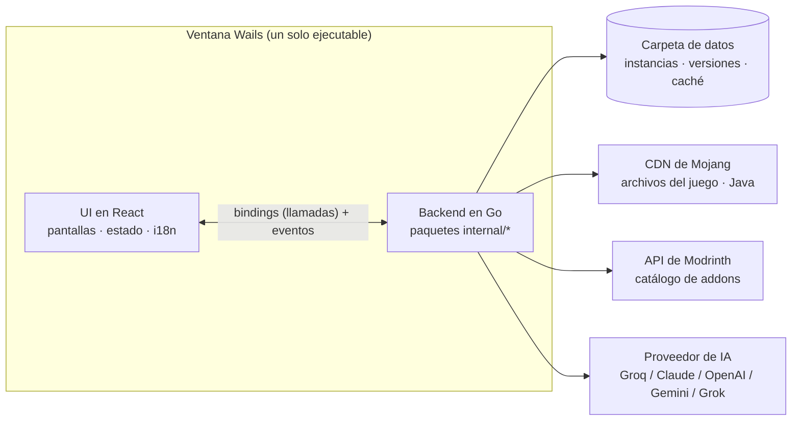

# Diseño del sistema — Udeos Launcher

Cuatro páginas cortas que describen el launcher como un *sistema*: qué contiene
a qué, qué significa cada palabra, cómo se mueve un jugador por él y cómo se
encuentra el contenido. Complementan las páginas numeradas de [`docs/`](../README.md)
(que explican *cómo se construye cada función*); léelas primero para tener la
visión general.

| # | Página | Responde |
|---|------|---------|
| 1 | [Jerarquía](01-hierarchy.md) | Qué contiene a qué: perfil → instancias → contenido, y las capas del código |
| 2 | [Glosario](02-glossary.md) | Cada palabra que usa el sistema (instancia, addon, loader, perfil, …) y qué significa |
| 3 | [Navegación](03-navigation.md) | Qué pantallas existen, cómo se mueve el jugador entre ellas y cómo funciona Volver |
| 4 | [Búsqueda](04-search.md) | Cómo funciona la búsqueda: la API, los filtros, el caché/indexado y el asistente de IA |

## El sistema en una imagen

- La **UI nunca toca la red ni el disco**. Todo pasa por Go.
- **Modrinth** es la única fuente de addons y el único "motor de búsqueda".
- La **IA** nunca inventa addons: solo traduce palabras a filtros de Modrinth y
  ordena lo que Modrinth devolvió.

> Nota de alcance: estas páginas describen el código de la versión 1.2.x-beta.
> Donde algo *no* existe (p. ej. no hay un índice de búsqueda local), la página
> lo dice explícitamente en lugar de dar a entender que existe.
